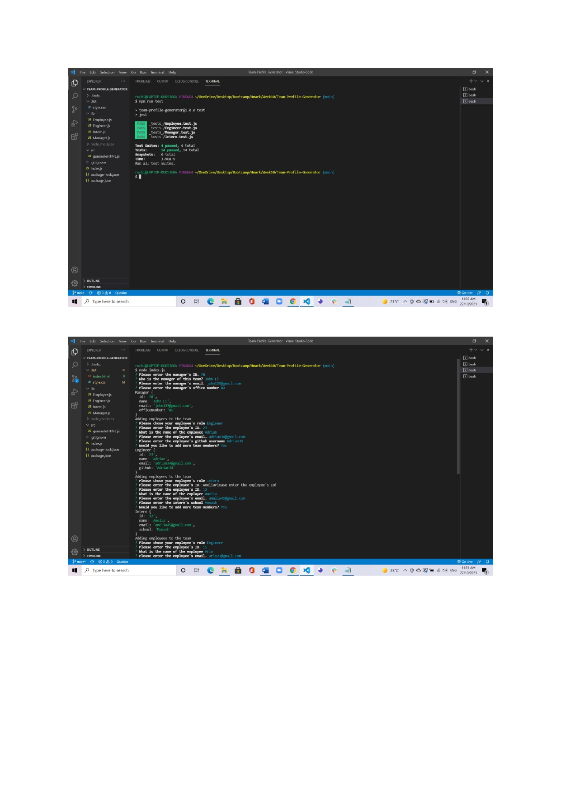
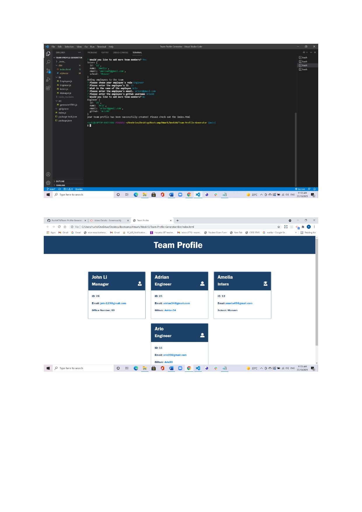

# Team Profile Generator 

## Description 
This application was created to generate a team profile based on user input using the Inquirer module from Node.js and displaying the information on a newly created html page with a style sheet. This project demonstrates use of OOP and TDD using Jest. 
 
## Table of Contents
* [Description](#description)
* [Installation](#installation)
* [Usage](#usage)
* [Screenshots](#screenshots)
* [Contributing](#contributing)
* [Tests](#tests)
* [Questions](#questions)

## Installation 
* The user should clone the repository from GitHub and download Node. 
* This application also requires a file system and inquirer module. 
* If testing is required, this application uses Jest.

## Usage 
View walk through video here to demonstrates the usage of application - [Screencastify](https://watch.screencastify.com/v/3nIGtyJXz0JHspsjNzCV)

## Screenshots 

## Contributing 
If you'd like to contact me, feel free to reach out using the Questions section below.

## Tests
Run `npm test` to run Jest for tests on constructors. 
* [The URL of the Run Test Video](https://watch.screencastify.com/v/FOCYmV0JtZ0vKyBIAUHH)

## Questions
* If you have any questions about this projects, please contact me at github.
* My GitHub user-name is Ruchi479